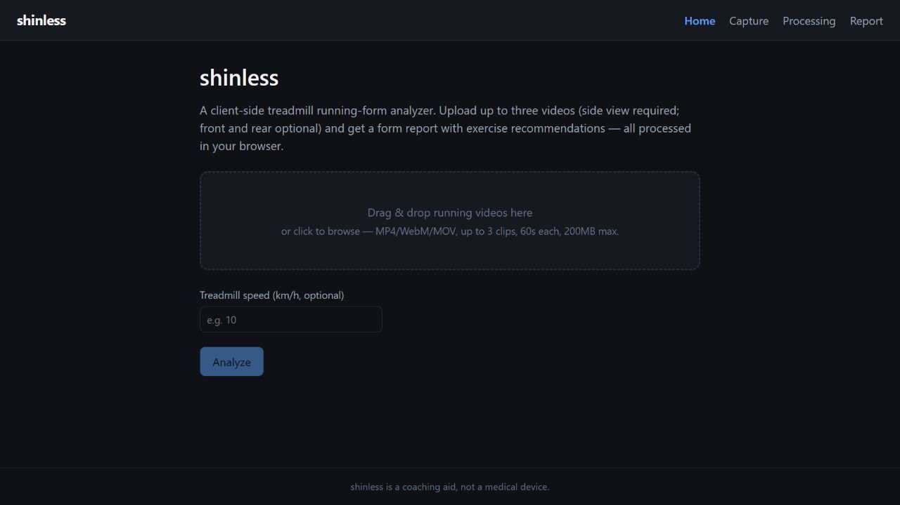

# Shinless

> A private, browser-based running-form analyzer that turns treadmill video into understandable gait metrics and coaching cues.




## Overview

Shinless analyzes short treadmill-running videos entirely in the browser. MediaPipe extracts pose landmarks frame by frame, the analysis layer identifies gait cycles and biomechanical metrics, and the report experience pairs findings with exercise recommendations. Videos remain on the user's device.

## Analysis capabilities

- Accepts a required side view with optional front and rear clips.
- Smooths pose landmarks before detecting strides and gait events.
- Measures cadence, arm swing, foot strike, hip drop, knee valgus, overstriding, stride asymmetry, trunk lean, and vertical oscillation.
- Scores capture quality so uncertain inputs are visible in the report.
- Overlays the detected skeleton on video for visual inspection.
- Maps findings to a curated exercise library.
- Processes media client-side without uploading video to a server.

## Tech stack

React 19 · TypeScript · MediaPipe Tasks Vision · React Router · Vite · Vitest

## Run locally

```bash
npm install
npm run dev
```

Quality checks:

```bash
npm test
npm run lint
npm run build
```

Shinless is a coaching aid and experimental software, not a medical device.
